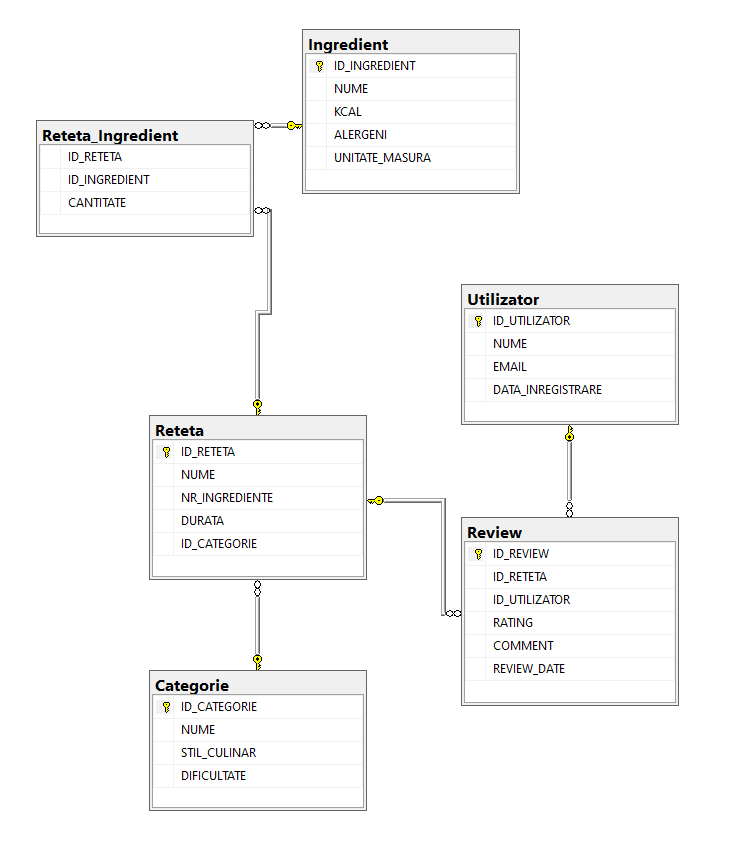
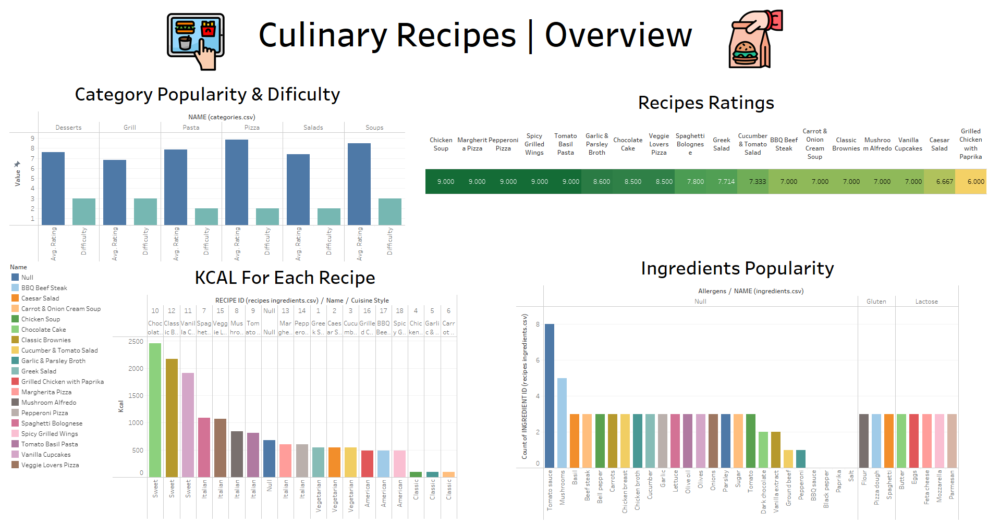

# Recipe Management Database + Tableau Dashboard Presentation

  A structured SQL database for managing recipes, ingredients, users, and reviews. It includes table definitions, relationships, stored procedures, views, and triggers to handle recipe creation, ingredient management, and user interactions.
  
  Also, a Tableau dashboard to visually present and analyze the cooking recipes data.

SQL Files:
  - 1_create_tables.sql = creating the tables of culinary recipes (Ingredient, Category, Recipe, UserAccount, Review, Recipe_Ingredient).
  - 2_insert_and_modify_data = handles data insertion and manipulation with sample data for ingredients, recipes, etc.
  - 3_data_queries = a series of queries that retrieve meaningful data, using UNION, INNER JOIN, FULL JOIN, IN, EXISTS, etc.
  - 4_validation_functions = user-defined functions for validating input data.
  - 5_stored_procedures = defines stored procedures for inserting data into the database with built-in validations.
  - 6_view_details = a view for recipe details
  - 7_triggers = SQL triggers that perform actions based on certain database events.

